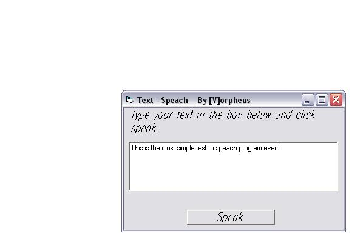



## \_/:\\ The simplest text to speech ever /:\\

### Description

This the most simple text to speach program ever! it only uses 1 line of code! YOU MUST HAVE THE text - speach engine FROM MICROSOFT, DOWNLOAD IT HERE: http://www.microsoft.com/msagent/downloads/user.asp#tts Please vote if you like it or not so that i know!
 
### More Info
 
YOU MUST HAVE THE text - speach engine FROM MICROSOFT, DOWNLOAD IT HERE: http://www.microsoft.com/msagent/downloads/user.asp#tts

             |
---                |---
**Submitted On**   |2003-08-13 14:54:42
**By**             |[\[V\]orpheus](https://github.com/Planet-Source-Code/PSCIndex/blob/master/ByAuthor/v-orpheus.md)
**Level**          |Intermediate
**User Rating**    |4.8 (63 globes from 13 users)
**Compatibility**  |VB 4\.0 \(32\-bit\), VB 5\.0, VB 6\.0, VB Script
**Category**       |[Miscellaneous](https://github.com/Planet-Source-Code/PSCIndex/blob/master/ByCategory/miscellaneous__1-1.md)
**World**          |[Visual Basic](https://github.com/Planet-Source-Code/PSCIndex/blob/master/ByWorld/visual-basic.md)
**Archive File**   |[\_\_\_\_\_The\_s163897912003\.zip](https://github.com/Planet-Source-Code/v-orpheus-the-simplest-text-to-speech-ever__1-48145/archive/master.zip)

